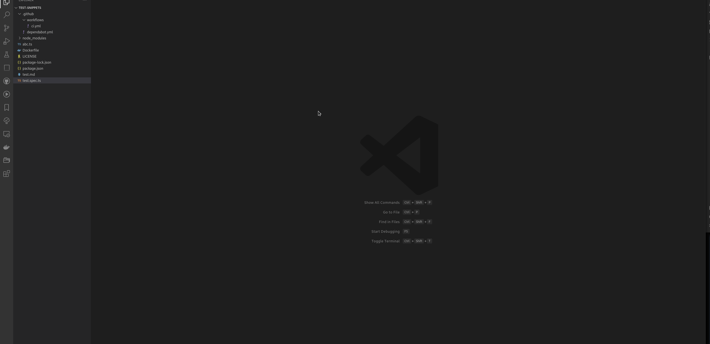
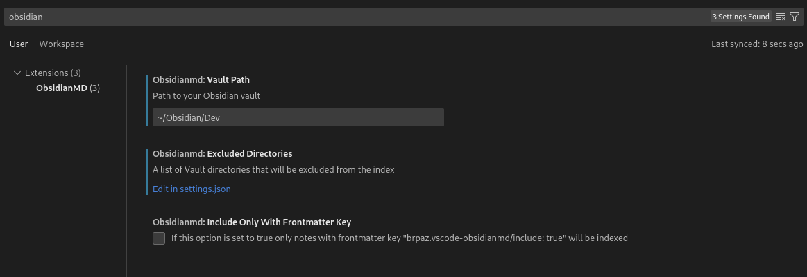

# VSCode ObsidianMD

> A [Visual Studio Extension](https://code.visualstudio.com/) for quick access your [Obsidian.md](https://obsidian.md/) vault, directly from your editor.

[](github.com/brpaz/vscode-obsidianmd/actions/workflows/ci.yml)
[](https://marketplace.visualstudio.com/items?itemName=brpaz.vscode-obsidianmd)
[](https://marketplace.visualstudio.com/items?itemName=brpaz.vscode-obsidianmd)
[](LICENSE)


## Demo




## Getting started

### Installation

Launch VS Code Quick Open (`Ctrl+P`), paste the following command, and press enter.

```sh
ext install brpaz.vscode-obsidianmd
```

## Usage


### Set up your vault path

Before using this extension, you have to configure the path to your Obsidian Vault.

Open VS Code Settings, and search for "Obsidian". Then set up the absolute path for your vault directory, on your system.



After that, the extension should pick your changes and start indexing your vault. If not, or anytime you want to reindex your vault, just open the Command Palette and execute the command `ObsidianMD: Index Vault`

### Searching on your vault

After your vault was successfully indexed, open command palette and type: `ObsidianMd: Search`. A list of all your notes will be presented and you can filter the results.

Clicking on an item, will open the note contents in the side of your open editor. You can also click on the little icon, in the right, which will open the note directly in Obsidian instead.

## ObsidianMD Extension Settings

The following table shows the available settings for the ObsidianMD extension in Visual Studio Code.

| Setting Name                               | Type    | Default Value | Description                                                                                                             |
| ------------------------------------------ | ------- | ------------- | ----------------------------------------------------------------------------------------------------------------------- |
| `obsidianmd.vaultPath`                     | string  | `""`          | Path to your Obsidian vault                                                                                             |
| `obsidianmd.excludedDirectories`           | array   | `[]`          | A list of Vault directories that will be excluded from the index                                                        |
| `obsidianmd.includeOnlyWithFrontmatterKey` | boolean | `false`       | If this option is set to true only notes with frontmatter key `"brpaz.vscode-obsidianmd/include: true"` will be indexed |

### `obsidianmd.vaultPath`

* Type: `string`
* Default Value: `""`
* Description: Path to your Obsidian vault

This setting allows you to specify the path to your Obsidian vault. The Obsidian vault is the directory where your notes are stored. By default, this setting is an empty string. You must set this value before being able to use the extension.

### `obsidianmd.excludedDirectories`

* Type: `array`
* Default Value: `[]`
* Description: A list of Vault directories that will be excluded from the index

This setting allows you to exclude specific directories within your vault from being indexed. You can specify one or more directories in an array. By default, this setting is an empty array, which means that all directories within the vault will be indexed.

When specifying directories, use only the path starting from the Vault folder.

### `obsidianmd.includeOnlyWithFrontmatterKey`

* Type: `boolean`
* Default Value: `false`
* Description: If this option is set to true only notes with frontmatter key `"brpaz.vscode-obsidianmd/include: true"` will be indexed

This setting allows you to control which notes are indexed based on the presence of a specific frontmatter key. If this setting is set to `true`, only notes that have a frontmatter key with the value `"true"` for `"brpaz.vscode-obsidianmd/include"` will be indexed. By default, this setting is `false`, which means that all notes in the vault will be indexed.

## Contributing

Contributions are what make the open source community such an amazing place to be learn, inspire, and create. Any contributions you make are **greatly appreciated**.

1. Fork the Project
2. Create your Feature Branch (`git checkout -b feature/AmazingFeature`)
3. Commit your Changes (`git commit -m 'Add some AmazingFeature'`)
4. Push to the Branch (`git push origin feature/AmazingFeature`)
5. Open a Pull Request


## Author

👤 **Bruno Paz**

* Website: [brunopaz.dev](https://brunopaz.dev)
* Github: [@brpaz](https://github.com/brpaz)


## 💛 Support the project

If this project was useful to you in some form, I would be glad to have your support.  It will help to keep the project alive and to have more time to work on Open Source.

The sinplest form of support is to give a ⭐️ to this repo.

You can also contribute with [GitHub Sponsors](https://github.com/sponsors/brpaz).

[](https://github.com/sponsors/brpaz)

Or if you prefer a one time donation to the project, you can simple:

<a href="https://www.buymeacoffee.com/Z1Bu6asGV" target="_blank"></a>


## 📝 License

Copyright © 2023 [Bruno Paz](https://github.com/brpaz).

This project is [MIT](https://opensource.org/licenses/MIT) licensed.

